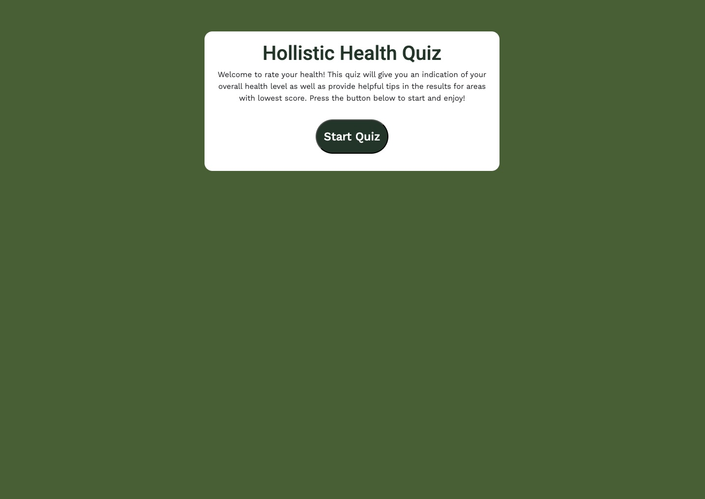
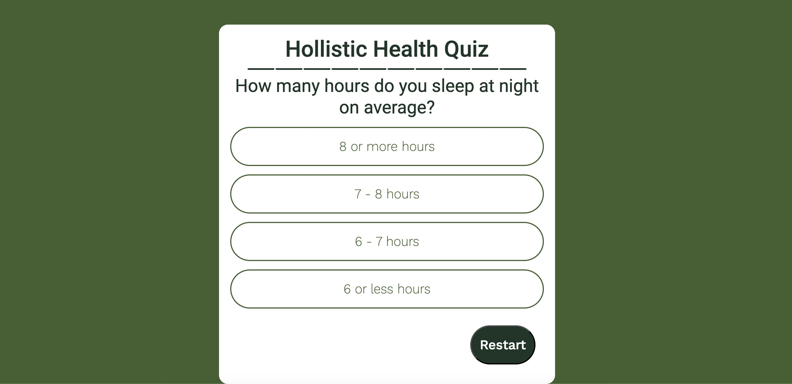
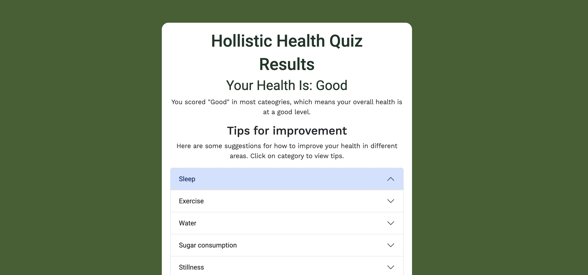
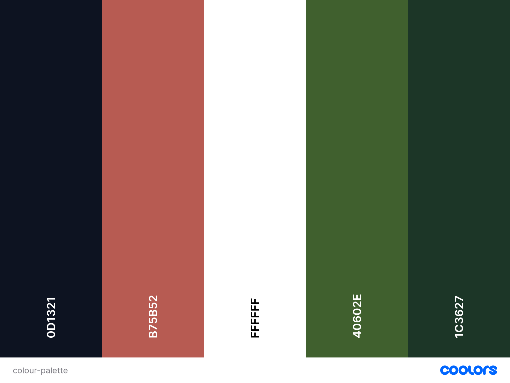

# Holistic Health Quiz

## Introduction

The Holistic Quiz is an interactive front-end website which displays a simple quiz to rate one's health in 4 categories: Excellent, Good, Can Be Improved and Needs Intervention. The result determines the category based on the highest answers in that category and lets the user know how they score, as well as, includes a number of tips for improving health. 

## User Experience

### User Stories 

- As a General User Looking to Assess Health, I want to take a health quiz that provides a general overview of my health, so that I can gain insights into areas where I might need to improve.
- As a fitness and lifestyle influencer, I want to have a tool that assess my health and fitness level, so that I can create more specific fitness goals and potentially share it with my followers.
- As a person preparing for an upcoming doctor's visit, I want to take a health quiz and be able to share my results with my healthcare provider, so that we can discuss my health in more detail during my appointment.
- As a company in health and wellbeing industry, we want to provide a tool on our website which helps customers rate their health, so that they gain even more value from us when it comes to health improvement.

## Design 

I wanted to create the website with a simple and dynamic design. It includes three sections that are displayed or hidden depending on action of the user. 

The first section is the Welcome Page that explains what the quiz is and features the Start button.

The next section is the quiz content, which displays the questions and possible answers. The user is taken to the next questions upon clicking an option. The Restart button takes the user back to the first question.

Finally, the user is shown the results page, which gives the category of their health as well as an accordion with tips in various areas. 

Typeography used for the website:

- 'Roboto' sans-serif Google font is used for the body text throughout the website.
- 'Kantumruy Pro' sans-serif Google font is used for the headings throughout the website.

Colourscheme is simple with a dark green and white the most prominent as well as accents of darker green colour and highlight redish colour for the progress bar.

## Technologies Used

- HTML5 was used for structure and content of the website.
- CSS3 was used for styling and layout.
- JavaScript was used for the interactivity of the website.
- Bootstrap library was used for the accordion element and responsive design.
- Google Fonts was used for all fonts on the website.
- Coolors was used for generating a colour palette.
- Git was used for version control through Gitpod terminal: git add ., git commit -m and git push.  
- Git Hub was used for storing code after being pushed from Git.

## Testing

### HTML Validator

No errors are displayed in the HTML 

### CSS Validator

No errors are displayed in the CSS 

### Lighthouse Validator

While the validator is showing that two variables are unused, commenting them out results in loss of functionality of the quiz with the user unable to progress through the questions. The answers are not checked and not able to add the score to a relevant category as well check if the number of questions reaches its limit. I am unsure what to change for the validator to stop displaying this warning. 

### Bugs

- There are currently no known bugs in the project

During the development the following mistakes were corrected and challenges overcome:

- getElementsById function was used to select the Start Button element, instead of querySelector, which disallowed to use addEventListener function to be added. It worked once I changed this.

- I didn't include {} around each qestion in questions array to make it an object, because of that the questions didn't itirate when I added checkAnswer() function. 

- I created an unnecessary function called endQuestion(), where I also incremented question number like in the checkAnswer() function amongst other code, so questions ended up incrementing twice when answer was selected and so the quiz only showed half of the questions. I then got rid of this function and called showResults() in the checkAnswer().

- When I first finished writing showResults() function and tested the quiz, I realised that it's very like for the user to have a muliple top score and for more than one result would then show. To mitigate this I created the nested if else loop to make sure if there is a multiple top score only the first instance is shown, which would make the result more meaningful for the user.

- When first validating HTML it showed that I incorrectly wrote Unordered List elements in the accordion of tips. I put li as a parent and ul as children, which resulted in lack of bulletpoints where I expected them. 

- I also found getting used to the new IDE (VS Code) a bit of a challange when connecting to Git. I managed to initiate it eventually and be able to commit changes without problems.

## Deployment

The project is deployed on GitHub pages and can be accessed by the following link:
https://j-mlo.github.io/quiz/ 

### Forking 

Fork this project following the steps:

1. Open [GitHub](https://github.com/).
2. Click on the project to be forked.
3. Find the 'Fork' button to the top right of the page.
4. Once you click the button the fork will be in your repository.

## Credits

### Content 

All the written content on the webpage is original, written by Joanna.

### Special Thanks 

 - Huge thank you to my mentor Spencer Bariball for his help, particularly with JavaScript functions.
 - Thank you to my husband and mum for their fair share of childcare to enable me to complete the project.