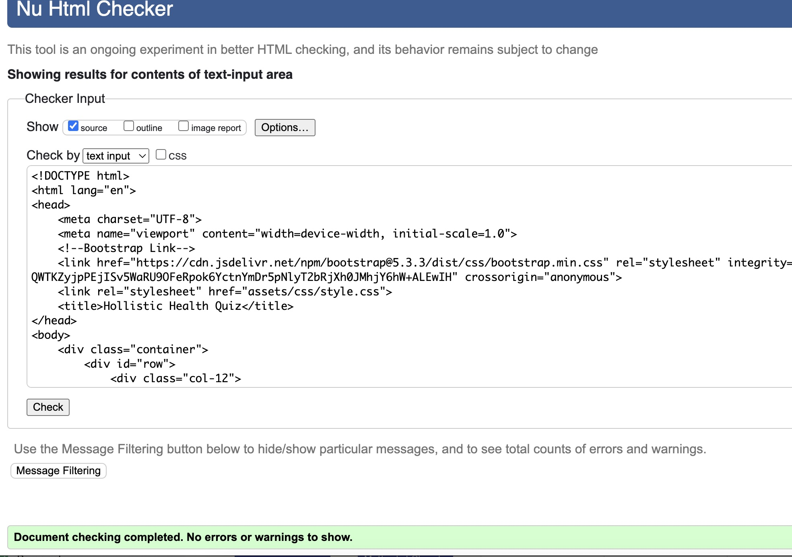

# Holistic Health Quiz

## Table of Contents
- [Introduction](#introduction)
- [User Experience](#user-experience)
- [Design](#design)
- [Features](#features)
- [Technologies Used](#technologies-used)
- [Testing](#testing)
- [Deployment](#deployment)
- [Credits](#credits)

## Introduction

The Holistic Quiz is an interactive front-end website which displays a simple quiz to rate one's health in 4 categories: Excellent, Good, Can Be Improved and Needs Intervention. The result determines the category based on the highest answers in that category and lets the user know how they score, as well as, including a number of tips for improving health. 

## User Experience

### User Stories 

- As a General User Looking to Assess Health, I want to take a health quiz that provides a general overview of my health, so that I can gain insights into areas where I might need to improve.
- As a fitness and lifestyle influencer, I want to have a tool that assess my health and fitness level, so that I can create more specific fitness goals and potentially share it with my followers.
- As a person preparing for an upcoming doctor's visit, I want to take a health quiz and be able to share my results with my healthcare provider, so that we can discuss my health in more detail during my appointment.
- As a company in health and wellbeing industry, we want to provide a tool on our website which helps customers rate their health, so that they gain even more value from us when it comes to health improvement.

## Design 

- 'Roboto' sans-serif Google font is used for the body text throughout the website.
- 'Kantumruy Pro' sans-serif Google font is used for the headings throughout the website.

## Technologies Used

- [HTML5](https://en.wikipedia.org/wiki/HTML) was used for structure and content of the website.
- [CSS3](https://en.wikipedia.org/wiki/Cascading_Style_Sheets) was used for styling and layout.
- [JavaScript] (https://en.wikipedia.org/wiki/JavaScript) was used for the interactivity of the website
- [Bootstrap](https://getbootstrap.com/) library was used for the accordion element.
- [Google Fonts](https://fonts.google.com/specimen/Roboto) was used for all fonts on the website.
- [Coolors](https://coolors.co/383838-e0144e-ffffff-cb9173) was used for generating a colour palette.
- [Git](https://git-scm.com/) was used for version control through Gitpod terminal: git add ., git commit -m and git push.  
- [Git Hub](https://github.com/) was used for storing code after being pushed from Git.

## Testing

### HTML Validator

### CSS Validator

### Lighthouse Validator

### Bugs

## Deployment

The project is deployed on GitHub pages and can be accessed by the following link:
https://j-mlo.github.io/quiz/ 

### Forking 

Fork this project following the steps:

1. Open [GitHub](https://github.com/).
2. Click on the project to be forked.
3. Find the 'Fork' button to the top right of the page.
4. Once you click the button the fork will be in your repository.

## Credits

### Content 

All the written content on the webpage is original, written by Joanna.

### Special Thanks 

 - Huge thank you to my mentor Spencer Bariball for his help with JavaScript functions.
 - Thank you to my husband and mum for their fair share of childcare to enable me to complete the project.